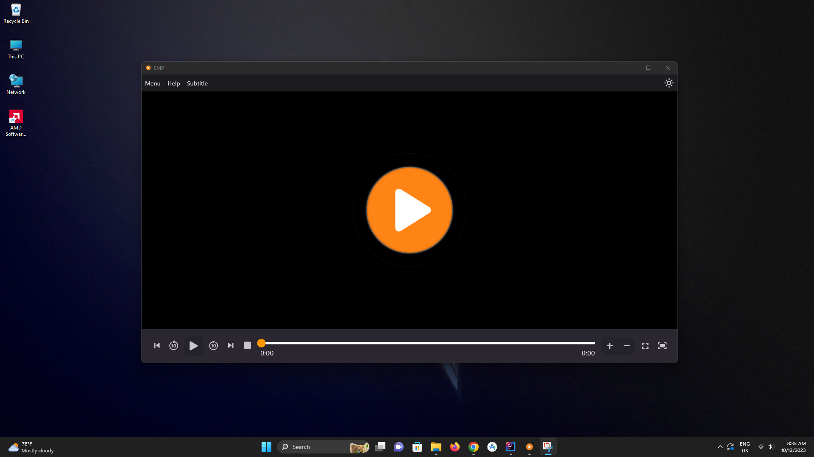
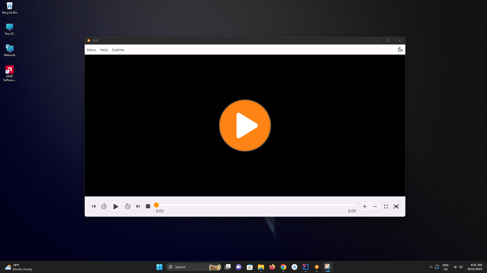
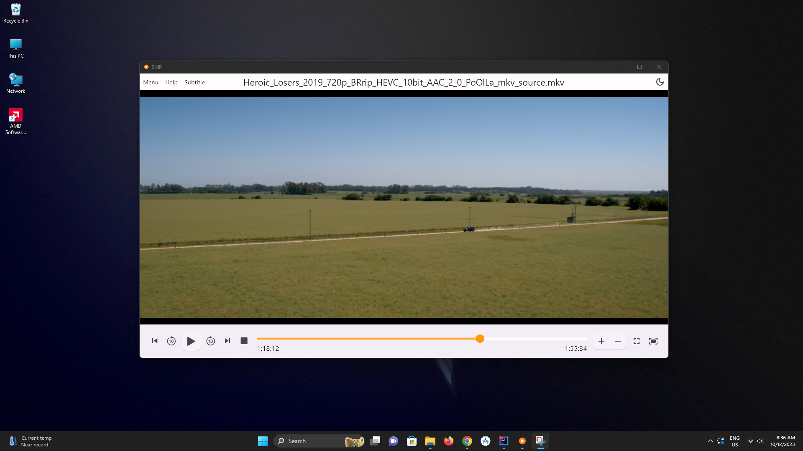

# SMP Media Player

#### A Simple Open source Media Player Application for Windows made with Flutter

## Features

. Watch Videos or Listen Audios from Local Drives

. Select Single or Multiple Media Files

. Add or Remove Subtitles

. Switch App Theme

. Supported wide variety of Media Formats

## Screenshots






# Building From Source

1. If you don't have Flutter SDK installed, please visit official [Flutter](https://flutter.dev/) site
2. Fetch latest source code from master branch
```
git clone https://github.com/rithik20/smp.git
```
Run the app with IntelliJ IDEA or VS Code. Or the command line:

```
flutter pub get
flutter run
```